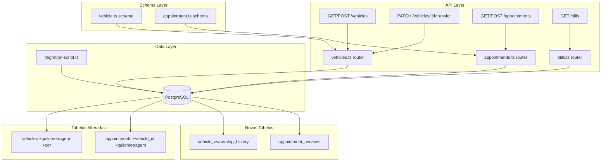
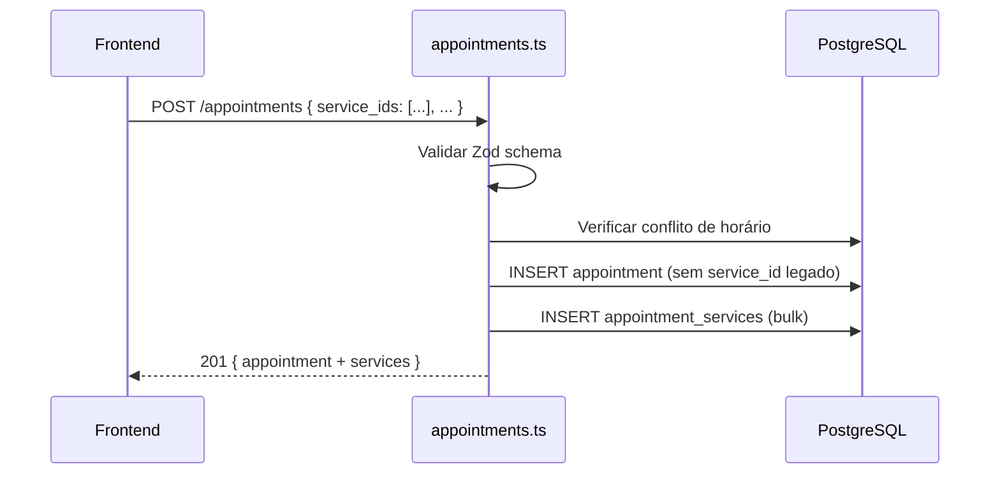
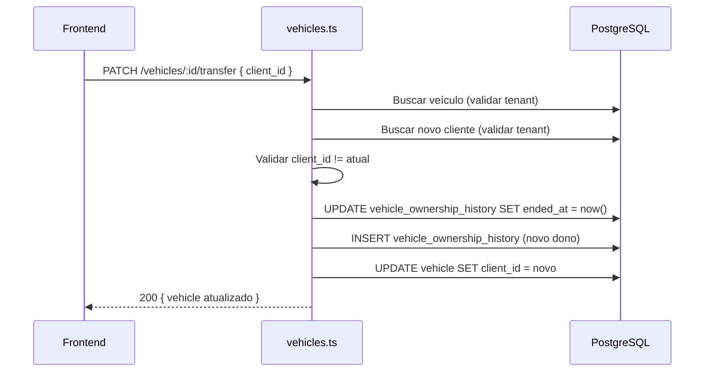

# Design — Melhorias de Feedback do Alex

## Visão Geral

Este documento descreve o design técnico para implementar as 9 melhorias solicitadas pelo Alex na plataforma de gestão de oficina mecânica. As mudanças abrangem:

1. **Filtros de data padrão** — Aplicar período padrão de ±30 dias nos endpoints de listagem de agendamentos e contas
2. **Múltiplos serviços por agendamento** — Relação many-to-many entre Appointment e Service via tabela de junção
3. **Migração de serviços das notas** — Script para extrair serviços do campo `notas` e criar registros AppointmentService
4. **Veículos como seção independente** — Novos endpoints top-level para veículos com busca e paginação
5. **Transferência de propriedade de veículo** — Endpoint de transferência com histórico de proprietários
6. **Vínculo de veículo ao agendamento** — Campo `vehicle_id` no Appointment
7. **Quilometragem no veículo** — Campo `quilometragem` no Vehicle
8. **Quilometragem no agendamento** — Campo `quilometragem` no Appointment com atualização automática ao concluir
9. **Campo de cor no veículo** — Campo `cor` no Vehicle

### Decisões de Design

- **Tabela de junção AppointmentService**: Optamos por uma tabela de junção explícita (não `@relation` implícita do Prisma) para permitir campos adicionais futuros (ex: valor por serviço, observações por serviço).
- **Campo legado `service_id`**: Mantido como nullable durante a migração para compatibilidade retroativa. Será removido em uma migração futura.
- **Migração de notas**: Implementada como script standalone executável via `npx ts-node` para permitir execução controlada e idempotente.
- **Histórico de propriedade**: Tabela `VehicleOwnershipHistory` separada para manter o histórico sem alterar a estrutura existente de Vehicle.
- **Atualização de quilometragem**: Apenas quando o valor do agendamento é maior que o atual do veículo, evitando regressão acidental.

---

## Arquitetura

### Diagrama de Componentes



### Fluxo de Dados — Múltiplos Serviços



### Fluxo de Dados — Transferência de Propriedade



---

## Componentes e Interfaces

### 1. Alterações no Router de Agendamentos (`appointments.ts`)

**POST /appointments** — Atualizado para aceitar `service_ids` (array) além do legado `service_id`:
- Valida que `service_ids` contém pelo menos 1 item (quando presente)
- Cria registros `AppointmentService` em transação
- Aceita `vehicle_id` e `quilometragem` opcionais
- Valida que `quilometragem` requer `vehicle_id`

**GET /appointments** — Atualizado:
- Aplica filtro padrão de ±30 dias quando `start`/`end` não fornecidos
- Inclui serviços via `AppointmentService` na resposta
- Inclui dados do veículo vinculado
- Inclui campo `quilometragem`

**PUT /appointments/:id** — Atualizado:
- Aceita `service_ids` para substituir serviços vinculados
- Aceita `vehicle_id` e `quilometragem`

**PATCH /appointments/:id/status** — Atualizado:
- Quando status muda para `CONCLUIDO` e o agendamento tem `vehicle_id` + `quilometragem`, atualiza a quilometragem do veículo se o valor for maior

### 2. Alterações no Router de Contas (`bills.ts`)

**GET /bills** — Atualizado:
- Aplica filtro padrão de ±30 dias em `data_vencimento` quando `start`/`end` não fornecidos

### 3. Novos Endpoints de Veículos (`vehicles.ts`)

**GET /vehicles** — Novo endpoint top-level:
- Paginação baseada em cursor (padrão existente)
- Parâmetro `search` para busca por placa, marca ou modelo (case-insensitive, parcial)
- Inclui dados do cliente proprietário

**GET /vehicles/:vehicleId** — Novo:
- Retorna veículo com dados do cliente e histórico de proprietários

**POST /vehicles** — Novo endpoint top-level:
- Aceita `client_id` no body
- Valida que o cliente pertence ao mesmo tenant

**PATCH /vehicles/:vehicleId/transfer** — Novo:
- Aceita `{ client_id }` no body
- Valida tenant, valida que não é o mesmo dono
- Cria registro de histórico e atualiza o veículo

### 4. Schemas Zod Atualizados

**`appointment.ts`** — Novos campos:
```typescript
// createAppointmentSchema - adicionar:
service_ids: z.array(z.string().uuid()).min(1).optional(),
vehicle_id: z.string().uuid().nullable().optional(),
quilometragem: z.number().int().min(0).nullable().optional(),

// updateAppointmentSchema - adicionar:
service_ids: z.array(z.string().uuid()).min(1).optional(),
vehicle_id: z.string().uuid().nullable().optional(),
quilometragem: z.number().int().min(0).nullable().optional(),
```

**`vehicle.ts`** — Novos campos:
```typescript
// createVehicleSchema - adicionar:
quilometragem: z.number().int().min(0).nullable().optional(),
cor: z.string().min(1).nullable().optional(),
client_id: z.string().uuid().optional(), // para POST /vehicles top-level

// updateVehicleSchema - adicionar:
quilometragem: z.number().int().min(0).nullable().optional(),
cor: z.string().min(1).nullable().optional(),
```

**Novo `vehicleTransfer.ts`**:
```typescript
export const vehicleTransferSchema = z.object({
  client_id: z.string().uuid('client_id inválido'),
});
```

### 5. Script de Migração de Notas (`scripts/migrate-notes-services.ts`)

- Percorre todos os tenants
- Para cada tenant, busca serviços cadastrados
- Para cada agendamento com `notas` preenchido:
  - Cria `AppointmentService` para o `service_id` legado (se existir)
  - Compara texto das notas com nomes de serviços (case-insensitive)
  - Cria `AppointmentService` para correspondências encontradas
  - Remove texto correspondente das notas
- Registra estatísticas em log

---

## Modelos de Dados

### Novas Tabelas

#### AppointmentService

```prisma
model AppointmentService {
  id             String   @id @default(uuid())
  appointment_id String
  service_id     String
  created_at     DateTime @default(now())

  appointment Appointment @relation(fields: [appointment_id], references: [id], onDelete: Cascade)
  service     Service     @relation(fields: [service_id], references: [id])

  @@unique([appointment_id, service_id])
  @@index([appointment_id])
  @@index([service_id])
  @@map("appointment_services")
}
```

#### VehicleOwnershipHistory

```prisma
model VehicleOwnershipHistory {
  id         String    @id @default(uuid())
  vehicle_id String
  client_id  String
  started_at DateTime  @default(now())
  ended_at   DateTime?
  created_at DateTime  @default(now())

  vehicle Vehicle @relation(fields: [vehicle_id], references: [id], onDelete: Cascade)
  client  Client  @relation(fields: [client_id], references: [id])

  @@index([vehicle_id])
  @@index([client_id])
  @@map("vehicle_ownership_history")
}
```

### Alterações em Tabelas Existentes

#### Appointment — Novos campos

| Campo | Tipo | Nullable | Descrição |
|-------|------|----------|-----------|
| `vehicle_id` | String (FK → Vehicle) | Sim | Veículo vinculado ao agendamento |
| `quilometragem` | Int | Sim | Quilometragem no momento do agendamento |
| `service_id` | String (FK → Service) | Sim (era obrigatório) | Tornado nullable para migração |

Novas relações:
- `appointmentServices AppointmentService[]` — Serviços vinculados via tabela de junção
- `vehicle Vehicle?` — Veículo vinculado

#### Vehicle — Novos campos

| Campo | Tipo | Nullable | Descrição |
|-------|------|----------|-----------|
| `quilometragem` | Int | Sim | Quilometragem atual do veículo |
| `cor` | String | Sim | Cor do veículo |

Novas relações:
- `ownershipHistory VehicleOwnershipHistory[]` — Histórico de proprietários
- `appointments Appointment[]` — Agendamentos vinculados

#### Service — Nova relação

- `appointmentServices AppointmentService[]` — Vínculo many-to-many com agendamentos

#### Client — Nova relação

- `ownershipHistory VehicleOwnershipHistory[]` — Histórico de veículos possuídos

### Migração SQL

```sql
-- 1. Novas tabelas
CREATE TABLE "appointment_services" (
    "id" TEXT NOT NULL,
    "appointment_id" TEXT NOT NULL,
    "service_id" TEXT NOT NULL,
    "created_at" TIMESTAMP(3) NOT NULL DEFAULT CURRENT_TIMESTAMP,
    CONSTRAINT "appointment_services_pkey" PRIMARY KEY ("id")
);

CREATE TABLE "vehicle_ownership_history" (
    "id" TEXT NOT NULL,
    "vehicle_id" TEXT NOT NULL,
    "client_id" TEXT NOT NULL,
    "started_at" TIMESTAMP(3) NOT NULL DEFAULT CURRENT_TIMESTAMP,
    "ended_at" TIMESTAMP(3),
    "created_at" TIMESTAMP(3) NOT NULL DEFAULT CURRENT_TIMESTAMP,
    CONSTRAINT "vehicle_ownership_history_pkey" PRIMARY KEY ("id")
);

-- 2. Novos campos em appointments
ALTER TABLE "appointments" ADD COLUMN "vehicle_id" TEXT;
ALTER TABLE "appointments" ADD COLUMN "quilometragem" INTEGER;

-- 3. Tornar service_id nullable em appointments
ALTER TABLE "appointments" ALTER COLUMN "service_id" DROP NOT NULL;

-- 4. Novos campos em vehicles
ALTER TABLE "vehicles" ADD COLUMN "quilometragem" INTEGER;
ALTER TABLE "vehicles" ADD COLUMN "cor" TEXT;

-- 5. Índices
CREATE UNIQUE INDEX "appointment_services_appointment_id_service_id_key"
    ON "appointment_services"("appointment_id", "service_id");
CREATE INDEX "appointment_services_appointment_id_idx"
    ON "appointment_services"("appointment_id");
CREATE INDEX "appointment_services_service_id_idx"
    ON "appointment_services"("service_id");
CREATE INDEX "vehicle_ownership_history_vehicle_id_idx"
    ON "vehicle_ownership_history"("vehicle_id");
CREATE INDEX "vehicle_ownership_history_client_id_idx"
    ON "vehicle_ownership_history"("client_id");

-- 6. Foreign keys
ALTER TABLE "appointment_services"
    ADD CONSTRAINT "appointment_services_appointment_id_fkey"
    FOREIGN KEY ("appointment_id") REFERENCES "appointments"("id")
    ON DELETE CASCADE ON UPDATE CASCADE;

ALTER TABLE "appointment_services"
    ADD CONSTRAINT "appointment_services_service_id_fkey"
    FOREIGN KEY ("service_id") REFERENCES "services"("id")
    ON DELETE RESTRICT ON UPDATE CASCADE;

ALTER TABLE "vehicle_ownership_history"
    ADD CONSTRAINT "vehicle_ownership_history_vehicle_id_fkey"
    FOREIGN KEY ("vehicle_id") REFERENCES "vehicles"("id")
    ON DELETE CASCADE ON UPDATE CASCADE;

ALTER TABLE "vehicle_ownership_history"
    ADD CONSTRAINT "vehicle_ownership_history_client_id_fkey"
    FOREIGN KEY ("client_id") REFERENCES "clients"("id")
    ON DELETE RESTRICT ON UPDATE CASCADE;

ALTER TABLE "appointments"
    ADD CONSTRAINT "appointments_vehicle_id_fkey"
    FOREIGN KEY ("vehicle_id") REFERENCES "vehicles"("id")
    ON DELETE SET NULL ON UPDATE CASCADE;
```

### Função Utilitária — Filtro de Data Padrão

```typescript
/**
 * Calcula o intervalo padrão de ±30 dias a partir da data atual.
 * Retorna { start, end } como objetos Date.
 */
export function getDefaultDateRange(): { start: Date; end: Date } {
  const now = new Date();
  const start = new Date(now);
  start.setDate(start.getDate() - 30);
  start.setHours(0, 0, 0, 0);

  const end = new Date(now);
  end.setDate(end.getDate() + 30);
  end.setHours(23, 59, 59, 999);

  return { start, end };
}
```

### Lógica de Correspondência de Notas (Migração)

```typescript
/**
 * Encontra nomes de serviços dentro do texto de notas.
 * Retorna os serviços encontrados e o texto restante.
 */
function matchServicesInNotes(
  notes: string,
  serviceNames: Map<string, string> // nome_lower -> service_id
): { matchedServiceIds: string[]; remainingNotes: string } {
  let remaining = notes;
  const matched: string[] = [];

  for (const [nameLower, serviceId] of serviceNames) {
    const regex = new RegExp(escapeRegex(nameLower), 'gi');
    if (regex.test(remaining)) {
      matched.push(serviceId);
      remaining = remaining.replace(regex, '').trim();
    }
  }

  // Limpar separadores órfãos (vírgulas, pontos-e-vírgulas, quebras de linha)
  remaining = remaining.replace(/^[\s,;.\-]+|[\s,;.\-]+$/g, '').trim();

  return { matchedServiceIds: matched, remainingNotes: remaining };
}
```


---

## Propriedades de Corretude

*Uma propriedade é uma característica ou comportamento que deve ser verdadeiro em todas as execuções válidas de um sistema — essencialmente, uma declaração formal sobre o que o sistema deve fazer. Propriedades servem como ponte entre especificações legíveis por humanos e garantias de corretude verificáveis por máquina.*

### Property 1: Filtro de data padrão produz intervalo correto de ±30 dias

*Para qualquer* data "agora", a função `getDefaultDateRange()` deve retornar um intervalo onde `start` é exatamente 30 dias antes de "agora" (início do dia) e `end` é exatamente 30 dias depois de "agora" (fim do dia). Além disso, para qualquer conjunto de registros com datas, aplicar o filtro padrão deve retornar apenas os registros cujas datas estão dentro do intervalo [start, end].

**Validates: Requirements 1.1, 1.2**

### Property 2: Filtros explícitos retornam apenas registros dentro do intervalo fornecido

*Para qualquer* intervalo [start, end] fornecido como parâmetros de query e qualquer conjunto de registros com datas, o endpoint deve retornar apenas registros cuja data está dentro do intervalo. Nenhum registro fora do intervalo deve ser incluído, e nenhum registro dentro do intervalo deve ser omitido.

**Validates: Requirements 1.3, 1.4**

### Property 3: Invariante de contagem de serviços vinculados ao agendamento

*Para qualquer* agendamento e qualquer array de `service_ids` de tamanho N (N ≥ 1), após criar ou atualizar o agendamento com esse array, deve haver exatamente N registros AppointmentService vinculados, e os service_ids desses registros devem ser exatamente os mesmos do array fornecido (sem duplicatas, sem omissões).

**Validates: Requirements 2.2, 2.4, 2.5**

### Property 4: Correspondência de serviços nas notas é case-insensitive e remove texto correspondente

*Para qualquer* texto de notas e qualquer conjunto de nomes de serviços, a função `matchServicesInNotes` deve: (a) encontrar correspondências independentemente do case (maiúsculas/minúsculas), (b) retornar um texto restante que não contém mais os nomes dos serviços encontrados, e (c) quando nenhum nome de serviço está presente no texto, retornar o texto original inalterado.

**Validates: Requirements 3.2, 3.4, 3.6**

### Property 5: Paginação cursor de veículos retorna todos os itens sem duplicatas

*Para qualquer* conjunto de veículos de um tenant, iterar por todas as páginas usando o cursor retornado deve produzir exatamente todos os veículos do tenant, sem duplicatas e sem omissões, independentemente do tamanho da página.

**Validates: Requirements 4.1**

### Property 6: Busca de veículos retorna apenas resultados correspondentes

*Para qualquer* termo de busca e qualquer conjunto de veículos, todos os veículos retornados pelo endpoint GET /vehicles?search=termo devem ter placa, marca ou modelo contendo o termo (correspondência parcial, case-insensitive). Nenhum veículo que não contém o termo em nenhum desses campos deve ser retornado.

**Validates: Requirements 4.6**

### Property 7: Isolamento de tenant em referências cruzadas

*Para qualquer* operação que referencia um `vehicle_id` ou `client_id` (criação/atualização de agendamento, criação de veículo, transferência), se o ID referenciado pertence a um tenant diferente do tenant da requisição, a operação deve ser rejeitada com erro.

**Validates: Requirements 4.4, 6.2, 6.4, 6.5**

### Property 8: Transferência de propriedade atualiza veículo e registra histórico

*Para qualquer* veículo e qualquer novo cliente válido (mesmo tenant, diferente do atual), após a transferência: (a) o `client_id` do veículo deve ser o novo cliente, (b) deve existir um registro de histórico com `ended_at` preenchido para o dono anterior, e (c) deve existir um novo registro de histórico com `started_at` preenchido e `ended_at` nulo para o novo dono.

**Validates: Requirements 5.2, 5.3**

### Property 9: Validação de campos de veículo (quilometragem e cor)

*Para qualquer* valor inteiro não-negativo, a validação de `quilometragem` deve aceitar o valor. Para qualquer valor negativo, deve rejeitar. Para qualquer string não-vazia, a validação de `cor` deve aceitar. Para string vazia, deve rejeitar. Para null, ambos devem aceitar.

**Validates: Requirements 7.3, 9.3**

### Property 10: Atualização de quilometragem ao concluir agendamento preserva o máximo

*Para qualquer* agendamento com `vehicle_id` e `quilometragem` Q, e veículo com quilometragem atual V, ao alterar o status para CONCLUIDO, a quilometragem do veículo deve ser `max(Q, V)`. Se Q > V, o veículo é atualizado. Se Q ≤ V, o veículo permanece inalterado.

**Validates: Requirements 8.3**

---

## Tratamento de Erros

### Erros de Validação (400)

| Cenário | Mensagem |
|---------|----------|
| `service_ids` vazio | "service_ids deve conter pelo menos 1 item" |
| `quilometragem` sem `vehicle_id` | "quilometragem requer vehicle_id" |
| `quilometragem` negativa | "quilometragem deve ser >= 0" |
| `cor` string vazia | "cor deve ser uma string não-vazia" |
| Transferência para mesmo cliente | "Veículo já pertence a este cliente" |
| Dados inválidos (Zod) | "Dados inválidos" + details |

### Erros de Não Encontrado (404)

| Cenário | Mensagem |
|---------|----------|
| Veículo não encontrado / outro tenant | "Veículo não encontrado" |
| Cliente não encontrado / outro tenant | "Cliente não encontrado" |
| Agendamento não encontrado / outro tenant | "Agendamento não encontrado" |

### Erros de Conflito (409)

| Cenário | Mensagem |
|---------|----------|
| Conflito de horário | "Horário indisponível" |
| Placa duplicada | "Placa já cadastrada neste estabelecimento" |

### Erros de Referência Cruzada (400)

| Cenário | Mensagem |
|---------|----------|
| `vehicle_id` de outro tenant | "Veículo não encontrado neste estabelecimento" |
| `service_id` inválido em `service_ids` | "Serviço não encontrado: {id}" |

### Erros Internos (500)

Todos os erros não tratados são logados via `logger.error()` e retornam `{ error: 'Erro interno do servidor' }`.

---

## Estratégia de Testes

### Abordagem Dual

A estratégia combina testes unitários (exemplos específicos) com testes baseados em propriedades (verificação universal):

- **Testes unitários (Vitest)**: Cobrem exemplos específicos, edge cases, integração entre componentes e cenários de erro
- **Testes de propriedade (fast-check + Vitest)**: Verificam propriedades universais com mínimo de 100 iterações por propriedade

### Biblioteca de Property-Based Testing

- **fast-check** (já disponível no projeto) para geração de dados aleatórios
- Cada teste de propriedade deve rodar no mínimo **100 iterações**
- Cada teste deve referenciar a propriedade do design com tag: `Feature: alex-feedback-improvements, Property {N}: {título}`

### Testes de Propriedade (PBT)

| Property | Descrição | Estratégia de Geração |
|----------|-----------|----------------------|
| 1 | Filtro padrão ±30 dias | Gerar datas aleatórias como "agora", verificar intervalo calculado |
| 2 | Filtros explícitos | Gerar intervalos [start, end] e conjuntos de datas, verificar filtragem |
| 3 | Contagem de serviços | Gerar arrays de UUIDs de tamanho 1-10, verificar contagem após create/update |
| 4 | Correspondência de notas | Gerar textos com nomes de serviços em cases variados, verificar remoção e correspondência |
| 5 | Paginação cursor | Gerar conjuntos de 0-50 veículos, paginar com tamanhos variados, verificar completude |
| 6 | Busca de veículos | Gerar termos de busca e veículos com dados variados, verificar filtragem |
| 7 | Isolamento de tenant | Gerar operações com IDs de tenants diferentes, verificar rejeição |
| 8 | Transferência de propriedade | Gerar sequências de transferências, verificar histórico e estado final |
| 9 | Validação de campos | Gerar valores inteiros (positivos, negativos, zero) e strings (vazias, não-vazias, null) |
| 10 | Quilometragem ao concluir | Gerar pares (Q, V) de quilometragens, verificar max(Q, V) |

### Testes Unitários

| Área | Cenários |
|------|----------|
| Filtros de data | Sem parâmetros aplica padrão; com parâmetros usa fornecidos; apenas start; apenas end |
| Múltiplos serviços | Criar com 1 serviço; criar com 3 serviços; atualizar serviços; service_ids vazio rejeitado |
| Migração de notas | Notas com 1 serviço; notas com múltiplos; notas sem correspondência; notas com case diferente |
| Veículos top-level | CRUD completo; busca por placa; busca por marca; paginação; endpoints aninhados mantidos |
| Transferência | Transferência válida; mesmo cliente; cliente de outro tenant; histórico após múltiplas transferências |
| Vínculo veículo-agendamento | Com vehicle_id; sem vehicle_id; vehicle_id de outro tenant |
| Quilometragem | Criar com km; atualizar km; km negativa rejeitada; atualização ao concluir (maior/menor/igual) |
| Cor | Criar com cor; atualizar cor; cor vazia rejeitada; cor null aceita |

### Testes de Integração

| Área | Cenários |
|------|----------|
| Script de migração | Execução completa com dados reais; idempotência; logging de estatísticas |
| Migração de banco | Schema atualizado corretamente; dados existentes preservados |

### Estrutura de Arquivos de Teste

```
packages/backend/src/__tests__/
├── appointments.test.ts          # Atualizar com novos cenários
├── bills.test.ts                 # Atualizar com filtro padrão
├── vehicles.test.ts              # Atualizar com novos endpoints
├── vehicle-transfer.test.ts      # Novo: transferência de propriedade
├── migration-notes.test.ts       # Novo: script de migração
├── properties/
│   ├── date-filter.property.ts   # Properties 1-2
│   ├── appointment-services.property.ts  # Property 3
│   ├── notes-matching.property.ts        # Property 4
│   ├── vehicle-pagination.property.ts    # Property 5
│   ├── vehicle-search.property.ts        # Property 6
│   ├── tenant-isolation.property.ts      # Property 7
│   ├── vehicle-transfer.property.ts      # Property 8
│   ├── vehicle-validation.property.ts    # Property 9
│   └── mileage-update.property.ts        # Property 10
```
