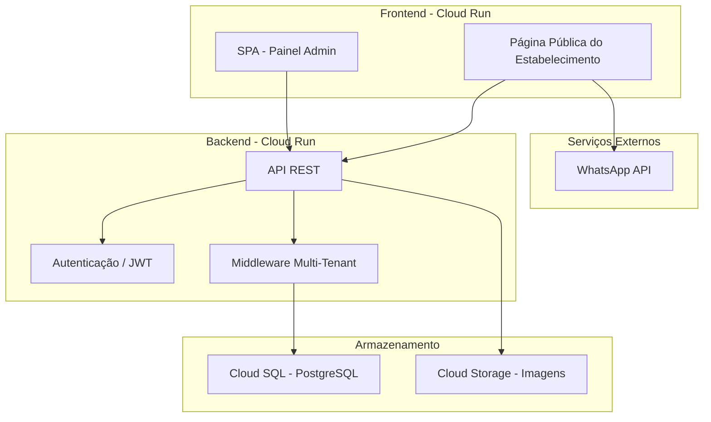
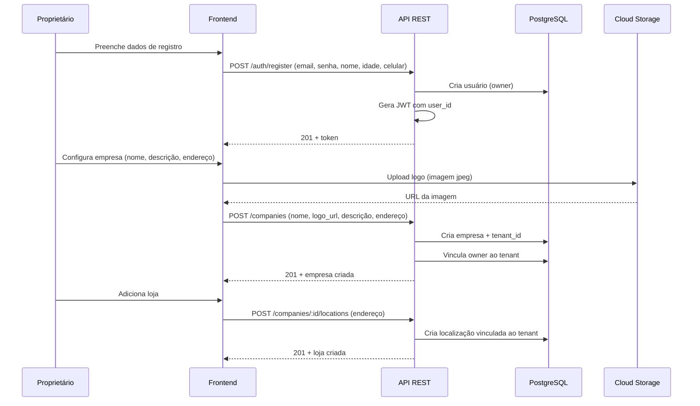
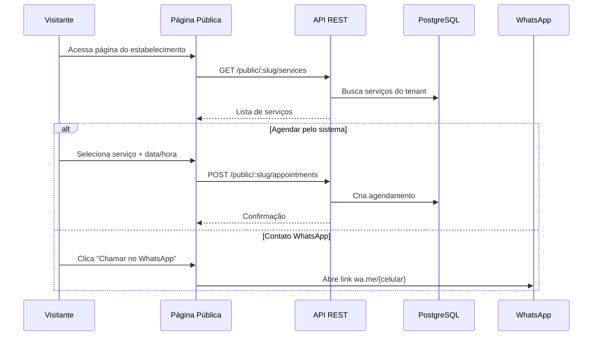
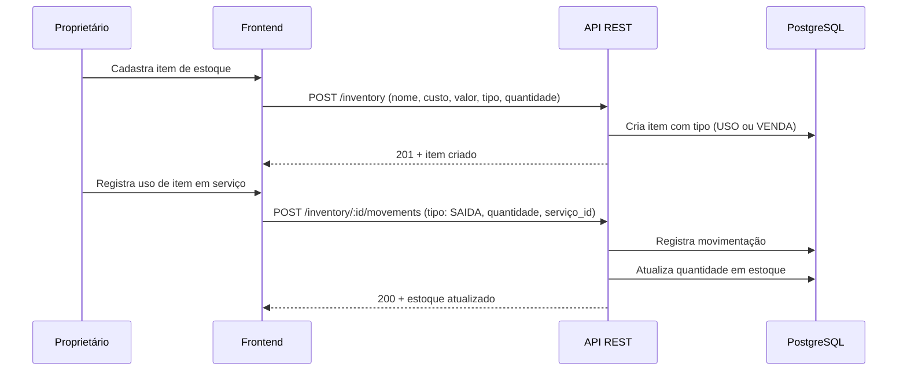

# Documento de Design: Plataforma de Gerenciamento de Serviços Multi-Tenant

## Visão Geral

A plataforma é um SaaS multi-tenant para gerenciamento de estabelecimentos de serviços. Cada usuário (proprietário) cria sua conta, configura sua empresa com uma ou mais lojas, cadastra serviços oferecidos e gerencia clientes, veículos, estoque, contas financeiras e agendamentos através de um calendário integrado.

O sistema possui duas faces: um painel administrativo para o proprietário gerenciar seu negócio, e uma página pública onde visitantes podem agendar serviços diretamente ou entrar em contato via WhatsApp. A arquitetura é projetada para deploy no Google Cloud Platform (GCP), utilizando serviços gerenciados para escalabilidade e custo otimizado em fase piloto.

A separação multi-tenant é feita por isolamento lógico no banco de dados, onde cada tenant (empresa) possui um identificador único que filtra todos os dados. Isso permite uma infraestrutura compartilhada com custos reduzidos, ideal para um piloto.

## Arquitetura

A arquitetura segue o padrão de aplicação web moderna com frontend SPA, API REST backend e banco de dados relacional, todos hospedados no GCP.



### Decisões de Arquitetura

- **Cloud Run**: Serverless, escala a zero (custo mínimo no piloto), suporta containers Docker
- **Cloud SQL PostgreSQL**: Banco relacional gerenciado, suporte nativo a JSON para flexibilidade
- **Cloud Storage**: Armazenamento de imagens (logos, fotos de serviços, fotos de proprietários)
- **Multi-tenancy lógica**: Uma única instância de banco com coluna `tenant_id` em todas as tabelas
- **JWT**: Autenticação stateless com tokens que incluem `tenant_id`

## Diagramas de Sequência

### Fluxo de Registro e Configuração da Empresa



### Fluxo de Agendamento Público



### Fluxo de Gerenciamento de Estoque




## Componentes e Interfaces

### Componente 1: Autenticação (AuthService)

**Propósito**: Gerenciar registro, login e emissão de tokens JWT com contexto multi-tenant.

```pascal
INTERFACE AuthService
  PROCEDURE register(email, senha, nome, idade, celular, foto_url) : AuthResult
  PROCEDURE login(email, senha) : AuthResult
  PROCEDURE refreshToken(token) : AuthResult
  PROCEDURE validateToken(token) : TokenPayload
END INTERFACE

STRUCTURE AuthResult
  token: String
  user: UserProfile
  tenant_id: UUID (NULLABLE - null até configurar empresa)
END STRUCTURE

STRUCTURE TokenPayload
  user_id: UUID
  tenant_id: UUID
  role: String
  exp: Timestamp
END STRUCTURE
```

**Responsabilidades**:
- Registro de novos proprietários com hash seguro de senha
- Autenticação via email/senha
- Emissão e validação de JWT com tenant_id embutido
- Refresh de tokens expirados

### Componente 2: Gerenciamento de Empresa (CompanyService)

**Propósito**: CRUD de empresas e lojas vinculadas ao tenant.

```pascal
INTERFACE CompanyService
  PROCEDURE createCompany(tenant_id, nome, logo_url, descricao, endereco) : Company
  PROCEDURE updateCompany(tenant_id, company_id, dados) : Company
  PROCEDURE getCompany(tenant_id) : Company
  PROCEDURE addLocation(tenant_id, company_id, endereco) : Location
  PROCEDURE listLocations(tenant_id, company_id) : Lista<Location>
  PROCEDURE updateLocation(tenant_id, location_id, endereco) : Location
  PROCEDURE deleteLocation(tenant_id, location_id) : Boolean
END INTERFACE
```

**Responsabilidades**:
- Criação da empresa com geração automática de slug público
- Gerenciamento de múltiplas lojas/localizações
- Upload e vinculação de logo via Cloud Storage
- Garantir isolamento por tenant_id

### Componente 3: Gerenciamento de Serviços (ServiceService)

**Propósito**: CRUD dos serviços oferecidos pelo estabelecimento.

```pascal
INTERFACE ServiceService
  PROCEDURE createService(tenant_id, nome, descricao, foto_url) : Service
  PROCEDURE updateService(tenant_id, service_id, dados) : Service
  PROCEDURE listServices(tenant_id) : Lista<Service>
  PROCEDURE deleteService(tenant_id, service_id) : Boolean
  PROCEDURE listPublicServices(slug) : Lista<ServicePublic>
END INTERFACE
```

**Responsabilidades**:
- CRUD de serviços com foto opcional
- Listagem pública de serviços (sem autenticação, filtrado por slug)
- Vinculação de serviços a localizações

### Componente 4: Gerenciamento de Clientes (ClientService)

**Propósito**: CRUD de clientes do estabelecimento.

```pascal
INTERFACE ClientService
  PROCEDURE createClient(tenant_id, nome, email, celular, data_nascimento) : Client
  PROCEDURE updateClient(tenant_id, client_id, dados) : Client
  PROCEDURE listClients(tenant_id, filtros) : PaginatedList<Client>
  PROCEDURE getClient(tenant_id, client_id) : Client
  PROCEDURE deleteClient(tenant_id, client_id) : Boolean
END INTERFACE
```

### Componente 5: Gerenciamento de Veículos (VehicleService)

**Propósito**: CRUD de veículos vinculados a clientes.

```pascal
INTERFACE VehicleService
  PROCEDURE createVehicle(tenant_id, client_id, marca, modelo, ano, placa) : Vehicle
  PROCEDURE updateVehicle(tenant_id, vehicle_id, dados) : Vehicle
  PROCEDURE listVehicles(tenant_id, client_id) : Lista<Vehicle>
  PROCEDURE deleteVehicle(tenant_id, vehicle_id) : Boolean
END INTERFACE
```

### Componente 6: Gerenciamento de Estoque (InventoryService)

**Propósito**: Controle de estoque com dois tipos: itens de uso interno (consumíveis usados em serviços) e peças para venda.

```pascal
INTERFACE InventoryService
  PROCEDURE createItem(tenant_id, nome, custo, valor_venda, tipo, quantidade_inicial) : InventoryItem
  PROCEDURE updateItem(tenant_id, item_id, dados) : InventoryItem
  PROCEDURE listItems(tenant_id, tipo_filtro) : PaginatedList<InventoryItem>
  PROCEDURE getItem(tenant_id, item_id) : InventoryItem
  PROCEDURE deleteItem(tenant_id, item_id) : Boolean
  PROCEDURE registerMovement(tenant_id, item_id, tipo_mov, quantidade, referencia_id) : StockMovement
  PROCEDURE listMovements(tenant_id, item_id, filtros) : PaginatedList<StockMovement>
  PROCEDURE getStockSummary(tenant_id) : StockSummary
END INTERFACE
```

**Responsabilidades**:
- Dois tipos de estoque: `USO` (consumíveis internos) e `VENDA` (peças para venda)
- Movimentações: `ENTRADA` (compra/reposição), `SAIDA_USO` (usado em serviço), `SAIDA_VENDA` (vendido ao cliente)
- Rastreamento de movimentações com referência ao serviço ou venda
- Alertas de estoque baixo

### Componente 7: Gerenciamento de Contas (BillService)

**Propósito**: Controle de contas a pagar.

```pascal
INTERFACE BillService
  PROCEDURE createBill(tenant_id, descricao, valor, data_pagamento) : Bill
  PROCEDURE updateBill(tenant_id, bill_id, dados) : Bill
  PROCEDURE listBills(tenant_id, filtros) : PaginatedList<Bill>
  PROCEDURE markAsPaid(tenant_id, bill_id) : Bill
  PROCEDURE deleteBill(tenant_id, bill_id) : Boolean
END INTERFACE
```

### Componente 8: Calendário e Agendamentos (AppointmentService)

**Propósito**: Gerenciamento de agendamentos de serviços com visualização em calendário.

```pascal
INTERFACE AppointmentService
  PROCEDURE createAppointment(tenant_id, client_id, service_id, location_id, data_hora, notas) : Appointment
  PROCEDURE updateAppointment(tenant_id, appointment_id, dados) : Appointment
  PROCEDURE cancelAppointment(tenant_id, appointment_id) : Appointment
  PROCEDURE listAppointments(tenant_id, data_inicio, data_fim) : Lista<Appointment>
  PROCEDURE getAppointment(tenant_id, appointment_id) : Appointment
  PROCEDURE createPublicAppointment(slug, nome_visitante, celular, service_id, data_hora) : Appointment
  PROCEDURE listAvailableSlots(slug, service_id, data) : Lista<TimeSlot>
END INTERFACE
```

**Responsabilidades**:
- Agendamento interno (pelo proprietário) e externo (pelo visitante)
- Verificação de conflitos de horário
- Listagem por período para visualização em calendário
- Status do agendamento: `AGENDADO`, `CONFIRMADO`, `EM_ANDAMENTO`, `CONCLUIDO`, `CANCELADO`

### Componente 9: Página Pública (PublicPageService)

**Propósito**: Servir dados públicos do estabelecimento para visitantes.

```pascal
INTERFACE PublicPageService
  PROCEDURE getPublicProfile(slug) : PublicProfile
  PROCEDURE listPublicServices(slug) : Lista<ServicePublic>
  PROCEDURE getWhatsAppLink(slug) : String
END INTERFACE
```


## Modelos de Dados

### Tenant

```pascal
STRUCTURE Tenant
  id: UUID (PK)
  slug: String (UNIQUE) -- usado na URL pública
  created_at: Timestamp
  updated_at: Timestamp
END STRUCTURE
```

### User (Proprietário)

```pascal
STRUCTURE User
  id: UUID (PK)
  tenant_id: UUID (FK -> Tenant, NULLABLE até criar empresa)
  email: String (UNIQUE)
  password_hash: String
  nome: String
  idade: Integer
  celular: String
  foto_url: String (NULLABLE)
  role: Enum(OWNER, ADMIN, EMPLOYEE)
  created_at: Timestamp
  updated_at: Timestamp
END STRUCTURE
```

**Regras de Validação**:
- Email deve ser único globalmente
- Senha mínimo 8 caracteres
- Celular no formato brasileiro (+55...)
- Idade >= 18

### Company (Empresa)

```pascal
STRUCTURE Company
  id: UUID (PK)
  tenant_id: UUID (FK -> Tenant, UNIQUE)
  nome: String
  logo_url: String (NULLABLE)
  descricao: String (NULLABLE)
  created_at: Timestamp
  updated_at: Timestamp
END STRUCTURE
```

### Location (Loja/Localização)

```pascal
STRUCTURE Location
  id: UUID (PK)
  tenant_id: UUID (FK -> Tenant)
  company_id: UUID (FK -> Company)
  endereco_rua: String
  endereco_numero: String
  endereco_complemento: String (NULLABLE)
  endereco_bairro: String
  endereco_cidade: String
  endereco_estado: String
  endereco_cep: String
  is_primary: Boolean
  created_at: Timestamp
  updated_at: Timestamp
END STRUCTURE
```

### Service (Serviço)

```pascal
STRUCTURE Service
  id: UUID (PK)
  tenant_id: UUID (FK -> Tenant)
  nome: String
  descricao: String (NULLABLE)
  foto_url: String (NULLABLE)
  duracao_minutos: Integer (DEFAULT 60)
  ativo: Boolean (DEFAULT true)
  created_at: Timestamp
  updated_at: Timestamp
END STRUCTURE
```

### Client (Cliente)

```pascal
STRUCTURE Client
  id: UUID (PK)
  tenant_id: UUID (FK -> Tenant)
  nome: String
  email: String (NULLABLE)
  celular: String
  data_nascimento: Date (NULLABLE)
  created_at: Timestamp
  updated_at: Timestamp
END STRUCTURE
```

**Regras de Validação**:
- Nome obrigatório
- Celular obrigatório e único por tenant
- Email único por tenant (quando informado)

### Vehicle (Veículo)

```pascal
STRUCTURE Vehicle
  id: UUID (PK)
  tenant_id: UUID (FK -> Tenant)
  client_id: UUID (FK -> Client)
  marca: String
  modelo: String
  ano: Integer
  placa: String
  created_at: Timestamp
  updated_at: Timestamp
END STRUCTURE
```

**Regras de Validação**:
- Placa única por tenant
- Ano entre 1900 e ano_atual + 1

### InventoryItem (Item de Estoque)

```pascal
STRUCTURE InventoryItem
  id: UUID (PK)
  tenant_id: UUID (FK -> Tenant)
  nome: String
  descricao: String (NULLABLE)
  custo: Decimal(10,2)
  valor_venda: Decimal(10,2)
  tipo: Enum(USO, VENDA)
  quantidade_atual: Integer
  quantidade_minima: Integer (DEFAULT 0) -- alerta de estoque baixo
  created_at: Timestamp
  updated_at: Timestamp
END STRUCTURE
```

### StockMovement (Movimentação de Estoque)

```pascal
STRUCTURE StockMovement
  id: UUID (PK)
  tenant_id: UUID (FK -> Tenant)
  item_id: UUID (FK -> InventoryItem)
  tipo: Enum(ENTRADA, SAIDA_USO, SAIDA_VENDA)
  quantidade: Integer
  referencia_tipo: Enum(SERVICO, VENDA, MANUAL) (NULLABLE)
  referencia_id: UUID (NULLABLE)
  notas: String (NULLABLE)
  created_at: Timestamp
END STRUCTURE
```

### Bill (Conta)

```pascal
STRUCTURE Bill
  id: UUID (PK)
  tenant_id: UUID (FK -> Tenant)
  descricao: String
  valor: Decimal(10,2)
  data_vencimento: Date
  data_pagamento: Date (NULLABLE)
  status: Enum(PENDENTE, PAGO, ATRASADO)
  created_at: Timestamp
  updated_at: Timestamp
END STRUCTURE
```

### Appointment (Agendamento)

```pascal
STRUCTURE Appointment
  id: UUID (PK)
  tenant_id: UUID (FK -> Tenant)
  client_id: UUID (FK -> Client, NULLABLE) -- null para agendamentos públicos
  service_id: UUID (FK -> Service)
  location_id: UUID (FK -> Location)
  data_hora: Timestamp
  duracao_minutos: Integer
  status: Enum(AGENDADO, CONFIRMADO, EM_ANDAMENTO, CONCLUIDO, CANCELADO)
  nome_visitante: String (NULLABLE) -- para agendamentos públicos
  celular_visitante: String (NULLABLE) -- para agendamentos públicos
  notas: String (NULLABLE)
  created_at: Timestamp
  updated_at: Timestamp
END STRUCTURE
```


## Pseudocódigo Algorítmico

### Algoritmo: Registro de Usuário e Criação de Tenant

```pascal
ALGORITHM registerUser(email, senha, nome, idade, celular, foto_url)
INPUT: dados de registro do proprietário
OUTPUT: AuthResult com token JWT

BEGIN
  -- Pré-condições
  ASSERT email IS NOT NULL AND isValidEmail(email)
  ASSERT senha IS NOT NULL AND LENGTH(senha) >= 8
  ASSERT nome IS NOT NULL AND LENGTH(nome) > 0
  ASSERT idade >= 18
  ASSERT celular IS NOT NULL AND isValidPhone(celular)

  -- Verificar unicidade do email
  existing_user ← database.findUserByEmail(email)
  IF existing_user IS NOT NULL THEN
    RETURN Error("Email já cadastrado")
  END IF

  -- Criar usuário
  password_hash ← bcrypt.hash(senha, SALT_ROUNDS)
  user ← database.createUser({
    id: generateUUID(),
    email: email,
    password_hash: password_hash,
    nome: nome,
    idade: idade,
    celular: celular,
    foto_url: foto_url,
    role: OWNER,
    tenant_id: NULL
  })

  -- Gerar token (sem tenant_id ainda)
  token ← jwt.sign({
    user_id: user.id,
    tenant_id: NULL,
    role: user.role
  }, SECRET_KEY, expiration: 24h)

  RETURN AuthResult(token, user, NULL)
END

-- Pós-condições:
-- user existe no banco com email único
-- token é JWT válido com user_id
-- tenant_id é NULL (será preenchido ao criar empresa)
```

### Algoritmo: Configuração da Empresa

```pascal
ALGORITHM setupCompany(tenant_id_context, user_id, nome, logo_url, descricao, endereco)
INPUT: dados da empresa e endereço da primeira loja
OUTPUT: Company com Location primária

BEGIN
  -- Pré-condições
  ASSERT user_id IS NOT NULL
  ASSERT nome IS NOT NULL AND LENGTH(nome) > 0
  ASSERT endereco IS NOT NULL

  user ← database.findUserById(user_id)
  ASSERT user IS NOT NULL
  ASSERT user.tenant_id IS NULL -- ainda não tem empresa

  -- Criar tenant
  slug ← generateSlug(nome) -- ex: "auto-center-silva"
  WHILE database.findTenantBySlug(slug) IS NOT NULL DO
    slug ← slug + "-" + randomSuffix(4)
  END WHILE

  tenant ← database.createTenant({
    id: generateUUID(),
    slug: slug
  })

  -- Criar empresa
  company ← database.createCompany({
    id: generateUUID(),
    tenant_id: tenant.id,
    nome: nome,
    logo_url: logo_url,
    descricao: descricao
  })

  -- Criar localização primária
  location ← database.createLocation({
    id: generateUUID(),
    tenant_id: tenant.id,
    company_id: company.id,
    endereco: endereco,
    is_primary: TRUE
  })

  -- Vincular usuário ao tenant
  database.updateUser(user_id, { tenant_id: tenant.id })

  -- Gerar novo token com tenant_id
  new_token ← jwt.sign({
    user_id: user.id,
    tenant_id: tenant.id,
    role: user.role
  }, SECRET_KEY, expiration: 24h)

  RETURN { company, location, token: new_token }
END

-- Pós-condições:
-- tenant existe com slug único
-- company vinculada ao tenant
-- location primária criada
-- user.tenant_id atualizado
-- novo token contém tenant_id
```

### Algoritmo: Movimentação de Estoque

```pascal
ALGORITHM registerStockMovement(tenant_id, item_id, tipo_mov, quantidade, ref_tipo, ref_id, notas)
INPUT: dados da movimentação de estoque
OUTPUT: StockMovement + InventoryItem atualizado

BEGIN
  -- Pré-condições
  ASSERT tenant_id IS NOT NULL
  ASSERT item_id IS NOT NULL
  ASSERT tipo_mov IN {ENTRADA, SAIDA_USO, SAIDA_VENDA}
  ASSERT quantidade > 0

  item ← database.findInventoryItem(tenant_id, item_id)
  ASSERT item IS NOT NULL
  ASSERT item.tenant_id = tenant_id -- isolamento multi-tenant

  -- Validar tipo de saída conforme tipo do item
  IF tipo_mov = SAIDA_VENDA THEN
    ASSERT item.tipo = VENDA -- só itens de venda podem ter saída de venda
  END IF

  IF tipo_mov = SAIDA_USO THEN
    ASSERT item.tipo = USO -- só itens de uso podem ter saída de uso
  END IF

  -- Calcular nova quantidade
  IF tipo_mov = ENTRADA THEN
    nova_quantidade ← item.quantidade_atual + quantidade
  ELSE
    -- Saída (USO ou VENDA)
    ASSERT item.quantidade_atual >= quantidade -- não permitir estoque negativo
    nova_quantidade ← item.quantidade_atual - quantidade
  END IF

  -- Registrar movimentação (transação atômica)
  BEGIN TRANSACTION
    movement ← database.createStockMovement({
      id: generateUUID(),
      tenant_id: tenant_id,
      item_id: item_id,
      tipo: tipo_mov,
      quantidade: quantidade,
      referencia_tipo: ref_tipo,
      referencia_id: ref_id,
      notas: notas
    })

    database.updateInventoryItem(item_id, {
      quantidade_atual: nova_quantidade
    })
  COMMIT TRANSACTION

  -- Verificar alerta de estoque baixo
  IF nova_quantidade <= item.quantidade_minima THEN
    EMIT event("ESTOQUE_BAIXO", { item_id, quantidade_atual: nova_quantidade })
  END IF

  RETURN { movement, item: { ...item, quantidade_atual: nova_quantidade } }
END

-- Pós-condições:
-- movimentação registrada no histórico
-- quantidade_atual do item atualizada corretamente
-- quantidade_atual >= 0 (nunca negativo)
-- se estoque baixo, evento emitido

-- Invariante de Loop: N/A (sem loops)
-- Invariante de Dados: SUM(entradas) - SUM(saídas) = quantidade_atual
```

### Algoritmo: Agendamento Público

```pascal
ALGORITHM createPublicAppointment(slug, nome_visitante, celular, service_id, data_hora)
INPUT: dados do agendamento feito por visitante
OUTPUT: Appointment criado

BEGIN
  -- Pré-condições
  ASSERT slug IS NOT NULL
  ASSERT nome_visitante IS NOT NULL AND LENGTH(nome_visitante) > 0
  ASSERT celular IS NOT NULL AND isValidPhone(celular)
  ASSERT service_id IS NOT NULL
  ASSERT data_hora IS NOT NULL AND data_hora > NOW()

  -- Resolver tenant pelo slug
  tenant ← database.findTenantBySlug(slug)
  IF tenant IS NULL THEN
    RETURN Error("Estabelecimento não encontrado")
  END IF

  -- Verificar se serviço existe e está ativo
  service ← database.findService(tenant.id, service_id)
  IF service IS NULL OR service.ativo = FALSE THEN
    RETURN Error("Serviço não disponível")
  END IF

  -- Buscar localização primária
  location ← database.findPrimaryLocation(tenant.id)
  ASSERT location IS NOT NULL

  -- Verificar conflito de horário
  fim_previsto ← data_hora + service.duracao_minutos MINUTES
  conflitos ← database.findAppointments(tenant.id, location.id, data_hora, fim_previsto)
    WHERE status NOT IN {CANCELADO, CONCLUIDO}

  IF LENGTH(conflitos) > 0 THEN
    RETURN Error("Horário indisponível. Escolha outro horário.")
  END IF

  -- Criar agendamento
  appointment ← database.createAppointment({
    id: generateUUID(),
    tenant_id: tenant.id,
    client_id: NULL,
    service_id: service_id,
    location_id: location.id,
    data_hora: data_hora,
    duracao_minutos: service.duracao_minutos,
    status: AGENDADO,
    nome_visitante: nome_visitante,
    celular_visitante: celular
  })

  RETURN appointment
END

-- Pós-condições:
-- agendamento criado com status AGENDADO
-- sem conflito de horário com outros agendamentos ativos
-- tenant resolvido corretamente pelo slug
```

### Algoritmo: Middleware Multi-Tenant

```pascal
ALGORITHM multiTenantMiddleware(request, next)
INPUT: requisição HTTP com token JWT
OUTPUT: requisição enriquecida com tenant_id ou erro 403

BEGIN
  -- Pré-condições
  ASSERT request.headers.authorization IS NOT NULL

  token ← extractBearerToken(request.headers.authorization)
  IF token IS NULL THEN
    RETURN HttpError(401, "Token não fornecido")
  END IF

  payload ← jwt.verify(token, SECRET_KEY)
  IF payload IS NULL THEN
    RETURN HttpError(401, "Token inválido")
  END IF

  IF payload.tenant_id IS NULL THEN
    -- Permitir apenas rotas de setup de empresa
    IF request.path NOT IN ALLOWED_SETUP_ROUTES THEN
      RETURN HttpError(403, "Configure sua empresa primeiro")
    END IF
  END IF

  -- Injetar contexto do tenant na requisição
  request.context.user_id ← payload.user_id
  request.context.tenant_id ← payload.tenant_id
  request.context.role ← payload.role

  RETURN next(request)
END

-- Pós-condições:
-- request.context contém user_id, tenant_id e role
-- requisições sem tenant_id só acessam rotas de setup
-- tokens inválidos retornam 401
```

### Algoritmo: Listagem de Horários Disponíveis

```pascal
ALGORITHM listAvailableSlots(slug, service_id, data)
INPUT: slug do estabelecimento, serviço desejado e data
OUTPUT: lista de horários disponíveis

BEGIN
  -- Pré-condições
  ASSERT slug IS NOT NULL
  ASSERT service_id IS NOT NULL
  ASSERT data IS NOT NULL AND data >= TODAY()

  tenant ← database.findTenantBySlug(slug)
  IF tenant IS NULL THEN
    RETURN Error("Estabelecimento não encontrado")
  END IF

  service ← database.findService(tenant.id, service_id)
  IF service IS NULL OR service.ativo = FALSE THEN
    RETURN Error("Serviço não disponível")
  END IF

  location ← database.findPrimaryLocation(tenant.id)

  -- Definir horário de funcionamento (configurável futuramente)
  horario_inicio ← 08:00
  horario_fim ← 18:00
  intervalo ← service.duracao_minutos

  -- Buscar agendamentos existentes no dia
  agendamentos ← database.findAppointments(tenant.id, location.id, data + horario_inicio, data + horario_fim)
    WHERE status NOT IN {CANCELADO, CONCLUIDO}

  -- Gerar slots disponíveis
  slots_disponiveis ← EMPTY LIST
  slot_atual ← data + horario_inicio

  WHILE slot_atual + intervalo MINUTES <= data + horario_fim DO
    -- Invariante: todos os slots anteriores foram verificados
    slot_fim ← slot_atual + intervalo MINUTES
    tem_conflito ← FALSE

    FOR EACH agendamento IN agendamentos DO
      ag_inicio ← agendamento.data_hora
      ag_fim ← ag_inicio + agendamento.duracao_minutos MINUTES

      IF slot_atual < ag_fim AND slot_fim > ag_inicio THEN
        tem_conflito ← TRUE
        BREAK
      END IF
    END FOR

    IF NOT tem_conflito THEN
      APPEND slot_atual TO slots_disponiveis
    END IF

    slot_atual ← slot_atual + intervalo MINUTES
  END WHILE

  RETURN slots_disponiveis
END

-- Pós-condições:
-- todos os slots retornados estão dentro do horário de funcionamento
-- nenhum slot retornado conflita com agendamento existente
-- slots estão ordenados cronologicamente

-- Invariante de Loop:
-- todos os slots verificados até o momento são válidos (sem conflito) ou foram descartados
-- slot_atual avança monotonicamente
```


## Funções-Chave com Especificações Formais

### Função: generateSlug()

```pascal
FUNCTION generateSlug(nome) : String
```

**Pré-condições:**
- `nome` é não-nulo e não-vazio

**Pós-condições:**
- Retorna string em lowercase
- Espaços substituídos por hífens
- Caracteres especiais removidos
- Acentos convertidos para ASCII (ex: "ção" → "cao")

### Função: validateTenantAccess()

```pascal
FUNCTION validateTenantAccess(request_tenant_id, resource_tenant_id) : Boolean
```

**Pré-condições:**
- Ambos os parâmetros são UUIDs válidos ou NULL

**Pós-condições:**
- Retorna TRUE se e somente se `request_tenant_id = resource_tenant_id`
- Retorna FALSE se qualquer um for NULL
- Nenhum efeito colateral

### Função: calculateStockBalance()

```pascal
FUNCTION calculateStockBalance(tenant_id, item_id) : Integer
```

**Pré-condições:**
- `tenant_id` e `item_id` são UUIDs válidos
- Item existe no banco

**Pós-condições:**
- Retorna SUM(movimentações ENTRADA) - SUM(movimentações SAIDA_USO + SAIDA_VENDA)
- Resultado >= 0
- Resultado = item.quantidade_atual (consistência)

**Invariante:**
- `quantidade_atual` sempre reflete o saldo real das movimentações

### Função: checkAppointmentConflict()

```pascal
FUNCTION checkAppointmentConflict(tenant_id, location_id, data_hora, duracao) : Boolean
```

**Pré-condições:**
- Todos os parâmetros são válidos
- `data_hora` é timestamp futuro
- `duracao` > 0

**Pós-condições:**
- Retorna TRUE se existe agendamento ativo que sobrepõe o intervalo [data_hora, data_hora + duracao]
- Agendamentos com status CANCELADO ou CONCLUIDO são ignorados
- Nenhuma mutação no banco

## Exemplo de Uso

```pascal
-- Exemplo 1: Registro completo de um proprietário
SEQUENCE
  -- Passo 1: Registro
  result ← registerUser("[email]", "senhaSegura123", "João Silva", 35, "+5511999999999", NULL)
  token ← result.token

  -- Passo 2: Upload da logo
  logo_url ← cloudStorage.upload("logo.jpeg", imageBytes)

  -- Passo 3: Configurar empresa
  endereco ← {
    rua: "Rua das Flores",
    numero: "123",
    bairro: "Centro",
    cidade: "São Paulo",
    estado: "SP",
    cep: "01001-000"
  }
  company_result ← setupCompany(NULL, result.user.id, "Auto Center Silva", logo_url, "Serviços automotivos", endereco)
  new_token ← company_result.token -- agora com tenant_id

  -- Passo 4: Cadastrar serviço
  service ← createService(company_result.company.tenant_id, "Troca de Óleo", "Troca completa com filtro", NULL)

  -- Passo 5: Cadastrar cliente e veículo
  client ← createClient(tenant_id, "Maria Santos", "[email]", "+5511888888888", "1990-05-15")
  vehicle ← createVehicle(tenant_id, client.id, "Toyota", "Corolla", 2022, "ABC1D23")

  -- Passo 6: Cadastrar item de estoque
  oleo ← createItem(tenant_id, "Óleo 5W30", 25.00, 0.00, USO, 50)
  filtro_venda ← createItem(tenant_id, "Filtro de Ar", 15.00, 45.00, VENDA, 20)

  -- Passo 7: Agendar serviço
  appointment ← createAppointment(tenant_id, client.id, service.id, location.id, "2025-01-15 10:00", "Corolla prata")

  -- Passo 8: Registrar uso de estoque no serviço
  registerStockMovement(tenant_id, oleo.id, SAIDA_USO, 4, SERVICO, appointment.id, "4 litros usados")
END SEQUENCE

-- Exemplo 2: Visitante agenda pelo site público
SEQUENCE
  -- Visitante acessa a página pública
  profile ← getPublicProfile("auto-center-silva")
  services ← listPublicServices("auto-center-silva")

  -- Verifica horários disponíveis
  slots ← listAvailableSlots("auto-center-silva", services[0].id, "2025-01-20")

  -- Agenda no primeiro horário disponível
  appointment ← createPublicAppointment("auto-center-silva", "Pedro Oliveira", "+5511777777777", services[0].id, slots[0])
END SEQUENCE
```

## Propriedades de Corretude

*Uma propriedade é uma característica ou comportamento que deve ser verdadeiro em todas as execuções válidas do sistema — essencialmente, uma declaração formal sobre o que o sistema deve fazer. Propriedades servem como ponte entre especificações legíveis por humanos e garantias de corretude verificáveis por máquina.*

### Propriedade 1: Isolamento Multi-Tenant

*Para qualquer* recurso R no sistema e qualquer requisição REQ, se R.tenant_id é diferente de REQ.context.tenant_id, então R não deve ser acessível via REQ. Isso vale para todos os tipos de recurso: empresas, lojas, serviços, clientes, veículos, itens de estoque, contas e agendamentos.

**Validates: Requirements 3.4, 3.5, 5.2, 6.3, 7.4, 7.5, 8.4, 9.2, 11.3, 12.5**

### Propriedade 2: Consistência de Estoque

*Para qualquer* item de estoque I e qualquer sequência de movimentações aplicadas a I, a quantidade_atual de I deve ser igual a SUM(movimentações ENTRADA) - SUM(movimentações SAIDA_USO + SAIDA_VENDA), e quantidade_atual deve ser >= 0.

**Validates: Requirements 10.1, 10.2, 10.3, 10.4, 10.8**

### Propriedade 3: Sem Conflito de Agendamento

*Para qualquer* par de agendamentos ativos A1 e A2 na mesma localização (onde ativo significa status diferente de CANCELADO e CONCLUIDO), os intervalos de tempo [A1.data_hora, A1.data_hora + A1.duracao] e [A2.data_hora, A2.data_hora + A2.duracao] não devem se sobrepor. Isso vale tanto para agendamentos internos quanto públicos.

**Validates: Requirements 12.2, 13.2**

### Propriedade 4: Unicidade de Slug

*Para qualquer* par de tenants T1 e T2 onde T1 ≠ T2, os slugs T1.slug e T2.slug devem ser diferentes.

**Validates: Requirements 4.2**

### Propriedade 5: Formato de Slug

*Para qualquer* nome de empresa, o slug gerado deve estar em lowercase, com espaços substituídos por hífens, sem caracteres especiais, e com acentos convertidos para ASCII.

**Validates: Requirements 4.4**

### Propriedade 6: Integridade de Tipo de Estoque

*Para qualquer* movimentação M vinculada a um item I, se M.tipo é SAIDA_VENDA então I.tipo deve ser VENDA, e se M.tipo é SAIDA_USO então I.tipo deve ser USO. Movimentações que violam essa regra devem ser rejeitadas.

**Validates: Requirements 10.5, 10.6**

### Propriedade 7: Agendamento Público Válido

*Para qualquer* agendamento A onde A.client_id é NULL (agendamento público), A.nome_visitante e A.celular_visitante devem ser não-nulos, e A.location_id deve corresponder à localização primária do tenant.

**Validates: Requirements 13.5, 13.6**

### Propriedade 8: Empresa Tem Localização Primária

*Para qualquer* empresa C no sistema, deve existir pelo menos uma localização L onde L.company_id = C.id e L.is_primary = TRUE.

**Validates: Requirements 4.6, 5.5**

### Propriedade 9: Registro Produz JWT com Tenant NULL

*Para qualquer* registro de proprietário com dados válidos, o JWT retornado deve conter user_id válido, role OWNER, e tenant_id NULL.

**Validates: Requirements 1.1, 1.6**

### Propriedade 10: Senha Nunca Armazenada em Texto Plano

*Para qualquer* usuário registrado no sistema, o campo password_hash deve conter um hash bcrypt válido e nunca deve ser igual à senha original em texto plano.

**Validates: Requirements 1.5**

### Propriedade 11: Unicidade por Tenant

*Para qualquer* tenant, não devem existir dois clientes com o mesmo celular, dois clientes com o mesmo email (quando informado), ou dois veículos com a mesma placa. Tentativas de criar duplicatas devem ser rejeitadas.

**Validates: Requirements 7.2, 7.3, 8.2**

### Propriedade 12: Unicidade Global de Email de Usuário

*Para qualquer* par de usuários U1 e U2 onde U1 ≠ U2, os emails U1.email e U2.email devem ser diferentes. Tentativas de registro com email existente devem ser rejeitadas com erro 409.

**Validates: Requirements 1.2**

### Propriedade 13: Horários Disponíveis Válidos

*Para qualquer* consulta de horários disponíveis para um serviço em uma data, todos os slots retornados devem estar dentro do horário de funcionamento (08:00-18:00), nenhum slot deve conflitar com agendamentos ativos existentes, cada slot deve ter duração suficiente para o serviço, e os slots devem estar ordenados cronologicamente.

**Validates: Requirements 14.1, 14.2, 14.5**

### Propriedade 14: Serviços Públicos São Apenas Ativos

*Para qualquer* consulta de serviços públicos via slug, todos os serviços retornados devem ter o campo ativo = TRUE. Serviços inativos nunca devem aparecer na listagem pública.

**Validates: Requirements 15.2**

### Propriedade 15: Ciclo de Vida de Conta

*Para qualquer* conta criada, o status inicial deve ser PENDENTE. Quando marcada como paga, o status deve mudar para PAGO e a data_pagamento deve ser preenchida.

**Validates: Requirements 11.1, 11.2**

### Propriedade 16: Duração Padrão de Serviço

*Para qualquer* serviço criado sem duração especificada, a duracao_minutos deve ser definida como 60.

**Validates: Requirements 6.5**

### Propriedade 17: Validação de Formatos de Entrada

*Para qualquer* entrada de dados no sistema: emails devem seguir formato válido, celulares devem seguir formato brasileiro (+55...), senhas devem ter mínimo 8 caracteres, idade deve ser >= 18, ano de veículo deve estar entre 1900 e ano_atual + 1, valores monetários devem ter precisão de até 2 casas decimais, e quantidades de estoque devem ser inteiros positivos.

**Validates: Requirements 1.3, 1.4, 8.3, 17.1, 17.2, 17.3, 17.4, 17.5**

### Propriedade 18: Link WhatsApp Correto

*Para qualquer* slug válido, o link do WhatsApp retornado deve seguir o formato wa.me/{celular} com o celular do proprietário do estabelecimento.

**Validates: Requirements 15.3**

### Propriedade 19: Alerta de Estoque Baixo

*Para qualquer* item de estoque cuja quantidade_atual atinge ou fica abaixo da quantidade_minima após uma movimentação, o sistema deve emitir um alerta de estoque baixo.

**Validates: Requirements 9.5**


## Tratamento de Erros

### Erro 1: Email Já Cadastrado

**Condição**: Tentativa de registro com email existente
**Resposta**: HTTP 409 Conflict - "Email já cadastrado"
**Recuperação**: Usuário deve usar outro email ou fazer login

### Erro 2: Acesso a Recurso de Outro Tenant

**Condição**: Token JWT com tenant_id diferente do recurso solicitado
**Resposta**: HTTP 403 Forbidden - "Acesso negado"
**Recuperação**: Nenhuma - violação de segurança registrada em log

### Erro 3: Estoque Insuficiente

**Condição**: Tentativa de saída com quantidade maior que estoque disponível
**Resposta**: HTTP 422 Unprocessable Entity - "Estoque insuficiente. Disponível: X"
**Recuperação**: Usuário deve registrar entrada de estoque ou reduzir quantidade

### Erro 4: Conflito de Horário

**Condição**: Tentativa de agendamento em horário já ocupado
**Resposta**: HTTP 409 Conflict - "Horário indisponível"
**Recuperação**: Retornar lista de horários disponíveis para o dia

### Erro 5: Slug Não Encontrado

**Condição**: Acesso à página pública com slug inexistente
**Resposta**: HTTP 404 Not Found - "Estabelecimento não encontrado"
**Recuperação**: Exibir página de erro amigável

### Erro 6: Token Expirado

**Condição**: JWT expirado
**Resposta**: HTTP 401 Unauthorized - "Sessão expirada"
**Recuperação**: Frontend redireciona para login ou tenta refresh token

### Erro 7: Upload de Imagem Inválido

**Condição**: Arquivo não é JPEG ou excede tamanho máximo (5MB)
**Resposta**: HTTP 400 Bad Request - "Formato inválido. Envie imagem JPEG até 5MB"
**Recuperação**: Usuário reenvia com formato/tamanho correto

## Estratégia de Testes

### Testes Unitários

- Validação de todos os modelos de dados (campos obrigatórios, formatos, limites)
- Lógica de cálculo de estoque (entradas, saídas, saldo)
- Geração e validação de slugs
- Detecção de conflitos de horário
- Middleware multi-tenant (isolamento de dados)
- Hash e verificação de senhas
- Geração e validação de JWT

### Testes Baseados em Propriedades

**Biblioteca**: fast-check (para testes em TypeScript/JavaScript)

- **Isolamento Multi-Tenant**: Para qualquer sequência de operações CRUD com tenant_ids diferentes, nenhum dado vaza entre tenants
- **Consistência de Estoque**: Para qualquer sequência de movimentações, quantidade_atual = SUM(entradas) - SUM(saídas) e nunca negativo
- **Sem Conflito de Agendamento**: Para qualquer conjunto de agendamentos criados com sucesso, nenhum par sobrepõe horário na mesma localização
- **Unicidade de Slug**: Para qualquer conjunto de empresas criadas, todos os slugs são únicos
- **Integridade de Tipo de Estoque**: Movimentações de saída sempre respeitam o tipo do item

### Testes de Integração

- Fluxo completo de registro → configuração de empresa → cadastro de serviço
- Fluxo de agendamento público (visitante → página pública → agendamento)
- Fluxo de estoque (cadastro → movimentação → verificação de saldo)
- Upload de imagens para Cloud Storage
- Autenticação completa (registro → login → acesso autenticado → refresh)

## Considerações de Performance

- **Índices no banco**: tenant_id em todas as tabelas, slug em Tenant, email em User, placa em Vehicle, data_hora em Appointment
- **Paginação**: Todas as listagens usam paginação cursor-based para performance consistente
- **Cache**: Dados públicos (perfil, serviços) podem ser cacheados com TTL de 5 minutos
- **Imagens**: Servidas diretamente do Cloud Storage com CDN, não passam pelo backend
- **Consultas**: Todas as queries filtram por tenant_id primeiro (índice primário de partição)

## Considerações de Segurança

- **Senhas**: Hash com bcrypt (salt rounds = 12)
- **JWT**: Tokens assinados com chave secreta rotacionada, expiração de 24h
- **Multi-tenant**: Isolamento forçado em TODAS as queries via middleware
- **Upload**: Validação de tipo MIME e tamanho no backend (não confiar no frontend)
- **SQL Injection**: Uso exclusivo de queries parametrizadas (ORM)
- **CORS**: Configurado para aceitar apenas origens autorizadas
- **Rate Limiting**: Endpoints públicos (login, registro, agendamento) com rate limit
- **HTTPS**: Obrigatório em produção via Cloud Run

## Dependências

- **Runtime**: Node.js / TypeScript (ou framework escolhido pelo desenvolvedor)
- **Banco de Dados**: PostgreSQL 15+ (Cloud SQL)
- **ORM**: Prisma ou TypeORM (para queries seguras e migrações)
- **Autenticação**: jsonwebtoken (JWT), bcrypt
- **Armazenamento**: Google Cloud Storage SDK
- **Validação**: zod ou joi (validação de entrada)
- **Deploy**: Docker + Cloud Run
- **Frontend**: Framework SPA (React, Vue ou similar)
- **Testes**: Vitest + fast-check (property-based testing)
